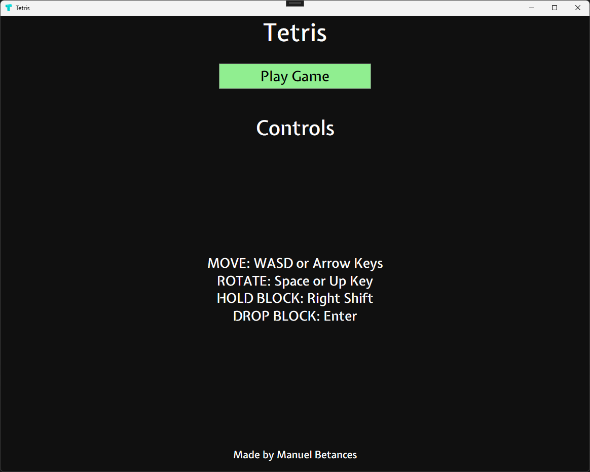
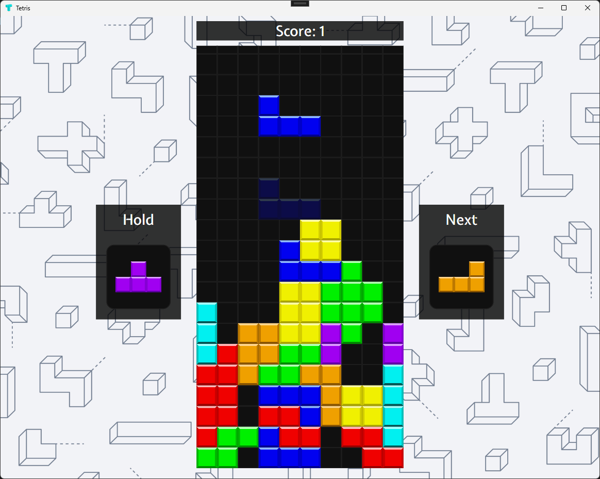

# Tetris

A recreation of the classic Tetris game completely written in C#.
The game features a Hold block feature to save a block for future moves. It tracks the player's score and increases its difficulty over time for replayability.

## Controls
- Move Blocks. Arrow Keys or WASD.
- Rotate Blocks. Arrow Key Up (Clockwise) Space (Counter-clockwise).
- Hold Block. Right Shift.
- Drop Block. Enter Key.

## Screenshots

### Main Menu Screen

### Gameplay

